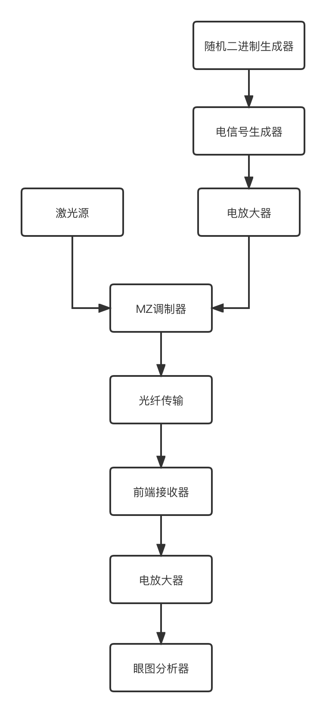

<h1 align="center">SimuLib</h1>

<p align="center">
中文文档 | <a href="./README.en.md">English Doc</a>
</p>

光纤传输仿真运算库，目前已经实现了主要的三个模块：

* 发射器模块
* 光纤传输模块
* 接收器模块

## 目录结构概览

```
SimuLib               (根目录)
├── CMakeLists.txt    (总的CMake配置文件)
├── includes/         (头文件目录)
├── lib/              (静态和动态库的目录)
├── bin/              (可执行文件目录)
├── src/              (C++源代码目录)
├── example/          (样例代码)
├── matlab-scripts/   (用做参考的MATLAB代码)
├── docs/             (文档目录)
├── files/            (临时数据文件，用做测试)
└── test/             (测试用例)
```

## 运行项目步骤

1. 鼠标右键根目录并点击 `Reload CMake Project`，然后CMake项目的配置文件就会被加载。通常来说，项目会在你用CLion打开时自动加载。

   

2. 点击Target右边的运行按钮，然后程序以及相关的依赖代码就会被编译运行。

   

## 仿真流程



## 软件架构


## 主要文件介绍（需要重点review的）

### src（C++代码目录）

* 代码总行数：1752

* 注释总行数：632

* 注释率：36%

* 空白行数：392

* 文件数量：22

该目录下有两个目录，一个是`gpu`，包含了少许CUDA代码，一个是`simulib`，基本主要的C++代码都在这里

* 工具函数文件：Tools.cpp, MatrixOperations.cpp, FFT.cpp, DecimalToBinary.cpp
* 全局变量相关文件：Globals.cpp, InitGstate.cpp
* 光纤业务逻辑相关文件：除以上两种之外其他所有文件

### includes（头文件目录）

* 代码总行数：743

* 注释总行数：411

* 注释率：55%

* 空白行数：259

* 文件数量：21

`src`目录下的`Eigen`和`unsupported`是依赖库不用看，Internal和SimuLib是用来包含所有的自定义头文件，`gpu`目录下的文件是CUDA相关的头文件，`parmat`目录下是用来实现CPU和GPU两种数据结构的代码，其余的文件都是工具型函数和光纤业务逻辑代码相关的文件。

### example（样例代码目录）

* 代码总行数：180

* 注释总行数：117

* 注释率：65%

* 空白行数：86

* 文件数量：3

Example.cpp是对上层提供的样例，是包含了所有器件的最完整的样例，TestExample.cpp是读取了固定的随机二进制数据用来方便比对和MATLAB的结果是否一致，EyeExample.cpp是仿照了Optilux ex11用来调试眼图分析器正确性的

### CMakeLists.txt（CMake配置文件）

在根目录以及各个小目录中都会有CMakeLists.txt文件，根目录下的CMakeLists.txt配置了全局性的信息，比如输出文件的位置，添加的编译器选项，加载外部依赖（MKL，CUDA），添加CMake子目录

各个小目录下的CMakeLists.txt文件一般用来将代码文件以target的形式加载进CMake项目，除此之外也会负责管理各个target之间的依赖关系

## SimuLib 遵循的代码风格

| Type           | Coding Style |
| -------------- | ------------ |
| Class, Struct  | PascalCase   |
| Function       | camelCase    |
| Variable       | camelCase    |
| File (.cpp .h) | PascalCase   |
| Constant value | SNAKE_CASE   |
| Enum           | SNAKE_CASE   |

