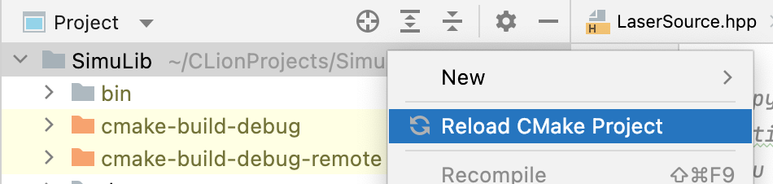
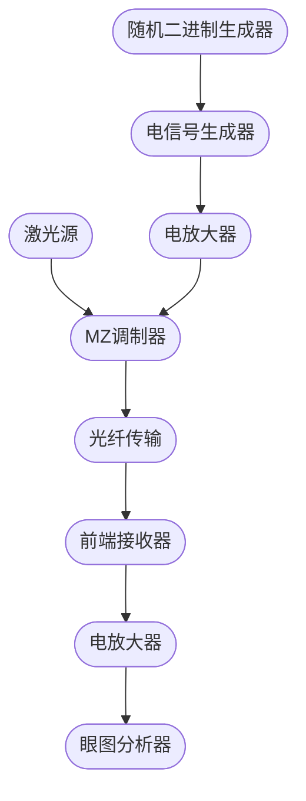

# SimuLib

一个基于 CUDA 的光纤仿真库，目前已经实现了三个主要模块：

* 光脉冲发射器
* 光纤
* 光脉冲接收器

该项目的组织结构：

```
SimuLib              (根目录)
├── .clang-format    (c++ coding style 格式化文件)
├── CMakeLists.txt   (cmake配置文件)
├── includes/        (头文件目录)
├── lib/             (链接库)
├── bin/             (可执行文件)
├── src/             (源代码文件)
├── example/         (样例代码)
├── docs/            (文档目录)
└── test/            (测试用例)
```

## 构建步骤

以下两种方式：命令行和 CLion 二选一即可。

### 命令行

首先，你需要确保以下工具已在你的电脑上安装。

* gcc/g++
* cmake
* ninja

然后依次输入以下命令：（确保你在主目录下）

```shell
# 所有的中间文件会被存储在 build 目录下
cmake -DCMAKE_MAKE_PROGRAM=ninja -DCMAKE_C_COMPILER=gcc -DCMAKE_CXX_COMPILER=g++ -G Ninja -S . -B build

# 构建 CPU 链接库
cmake --build build --target SimuLibCPU
```

现在 libSimuLibCPU.a 会出现在 `lib` 目录下，链接这个文件来使用 CPU 函数。

如果你想编译 GPU 库，首先确保 CUDA 在你的电脑上已被安装。然后输入以下命令：

```shell
# 构建 GPU 链接库
cmake --build build --target SimuLibGPU
```

然后 libSimuLibGPU.a 会出现在 `lib` 目录下，同时链接这两个库让你可以使用 CPU 和 GPU 的函数。

### CLion

1. 右击根目录然后点击 `Reload CMake Project`，然后CMake项目就会被重新加载。通常来说，在第一次用CLion打开仓库的时候就会自动加载一次，这样做是为了以防万一。

   

2. 点击在 `Example | Debug`右边的绿色小箭头，项目就会被构建并运行样例代码。

   

## 项目代码规范

你可以在 [这里](docs/Conventions.md) 查看项目的代码规范。

## 仿真流程图



