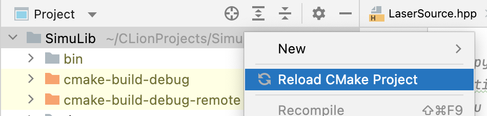

# SimuLib

Optical simulation library, which now includes three main modules of optical transmission simulation software:

* Emitter
* Fiber
* Receiver

The directory structure of the project:

```
SimuLib              (root directory)
├── .clang-format    (c++ coding style formatting file)
├── CMakeLists.txt   (global cmake config file)
├── includes/        (header files directory)
├── lib/             (static and dynamic libraries)
├── bin/             (executable files)
├── src/             (source code files)
├── example/         (example code)
├── docs/            (documents of the project)
└── test/            (test cases)
```

## Build Instructions

### Command Line Way

```shell
$ cmake --version # Make sure cmake has been installed
$ ninja --version # Make sure ninja has been installed
$ gcc --version # Make sure gcc has been installed
$ g++ --version # Make sure g++ has been installed
$ mkdir cmake-build-debug # Place cmake build files in this directory
$ cd cmake-build-debug
$ cmake -DCMAKE_BUILD_TYPE=Debug -DCMAKE_MAKE_PROGRAM=ninja -DCMAKE_C_COMPILER=gcc -DCMAKE_CXX_COMPILER=g++ -G Ninja ../ # Build CMake project
$ cd .. # Back to root directory
$ cmake --build cmake-build-debug --target <TARGET_NAME> # Then you can build and run any target with this command, the output executable file will be placed in the bin folder
```

### CLion Way

1. Right click the root directory and click `Reload CMake Project`, then the cmake project will be loaded. In general, the project will be loaded automatically by CLion at first time you open the project.

   

2. Click the run button on the right of `Example | Debug`, the program will be built and run.

   

### Notes

There are some test cases under `test` folder, which can be used for testing availability of different functions. All the required header files has been placed in the `includes` folder.

## Installation Requirements on different Operating Systems

### MacOS (Big Sur or higher)

1. Install the Intel® oneAPI Base Toolkit: [m_BaseKit_p_2022.1.0.92_offline.dmg](https://registrationcenter-download.intel.com/akdlm/irc_nas/18342/m_BaseKit_p_2022.1.0.92_offline.dmg
   ).
   
2. Install GNU GCC 7.* by `brew install gcc@7`, see [Homebrew](https://formulae.brew.sh/formula/gcc@7#default) for detail.

3. Configure `CLion > Preference > Build, Execution, Deployment > Toolchains`, add profile with C compiler (
   path: `/usr/local/Cellar/gcc@7/7.5.0_4/bin/gcc-7`) and C++ compiler (
   path: `/usr/local/Cellar/gcc@7/7.5.0_4/bin/g++-7`). Then move the new profile to the top as default.

### Ubuntu 18.04

1. (Optional) Recommend installation of Qt5 denpendencys by following this [link](https://wiki.qt.io/Building_Qt_5_from_Git)

```shell
$ sudo apt-get build-dep qt5-default
$ sudo apt-get install libxcb-xinerama0-dev
$ sudo apt-get install build-essential perl python git
$ sudo apt-get install '^libxcb.*-dev' libx11-xcb-dev libglu1-mesa-dev libxrender-dev libxi-dev libxkbcommon-dev libxkbcommon-x11-dev
$ sudo apt-get install flex bison gperf libicu-dev libxslt-dev ruby
$ sudo apt-get install libxcursor-dev libxcomposite-dev libxdamage-dev libxrandr-dev libxtst-dev libxss-dev libdbus-1-dev libevent-dev libfontconfig1-dev libcap-dev libpulse-dev libudev-dev libpci-dev libnss3-dev libasound2-dev libegl1-mesa-dev gperf bison nodejs
$ sudo apt-get install libasound2-dev libgstreamer1.0-dev libgstreamer-plugins-base1.0-dev libgstreamer-plugins-good1.0-dev libgstreamer-plugins-bad1.0-dev
$ sudo apt install libclang-6.0-dev llvm-6.0
```

2. GCC 7.5 should be distributed with Ubuntu 18.04 by default. Check the GCC version.

```shell
$ gcc --version
gcc (Ubuntu 7.5.0-3ubuntu1~18.04) 7.5.0
Copyright (C) 2017 Free Software Foundation, Inc.
This is free software; see the source for copying conditions.  There is NO
warranty; not even for MERCHANTABILITY or FITNESS FOR A PARTICULAR PURPOSE.

$ g++ --version
g++ (Ubuntu 7.5.0-3ubuntu1~18.04) 7.5.0
Copyright (C) 2017 Free Software Foundation, Inc.
This is free software; see the source for copying conditions.  There is NO
warranty; not even for MERCHANTABILITY or FITNESS FOR A PARTICULAR PURPOSE.
```

3. Install Intel® oneAPI Base Toolkit by following these [link1](https://www.intel.com/content/www/us/en/developer/tools/oneapi/base-toolkit-download.html?operatingsystem=linux&distributions=aptpackagemanager), [link2](https://www.intel.com/content/www/us/en/develop/documentation/installation-guide-for-intel-oneapi-toolkits-linux/top/installation/install-using-package-managers/apt.html#apt_apt-packages)

> (1) Remove all Intel® oneAPI packages

```shell
$ sudo apt autoremove intel-basekit intel-hpckit intel-iotkit intel-dlfdkit intel-aikit intel-renderkit
```

> (2) Set up the Intel® oneAPI repository:

```shell
# create 'mkl-set-repo.sh' with following contents and execute
$ wget -O- https://apt.repos.intel.com/intel-gpg-keys/GPG-PUB-KEY-INTEL-SW-PRODUCTS.PUB \
| gpg --dearmor | sudo tee /usr/share/keyrings/oneapi-archive-keyring.gpg > /dev/null

$ echo "deb [signed-by=/usr/share/keyrings/oneapi-archive-keyring.gpg] https://apt.repos.intel.com/oneapi all main" | sudo tee /etc/apt/sources.list.d/oneAPI.list
```

Notice: Change the 'Download from' option in 'Software and Updates > Ubuntu Software', choose a server in China, for example, mirrors.tuna.tsinghua.edu.cn

> (3) Update the repository and install

```shell
$ sudo apt update
$ sudo apt install intel-basekit intel-hpckit intel-iotkit intel-dlfdkit intel-aikit intel-renderkit
```

4. Configure `CLion > Preference > Build, Execution, Deployment > Toolchains`, add profile with C compiler (
   path: `/usr/bin/gcc`) and C++ compiler (path: `/usr/bin/g++`). Then move the new profile to the top as default.

## SimuLib Coding Style

The custom coding style of the project: [details](docs/SimuLib Coding Style.md)
